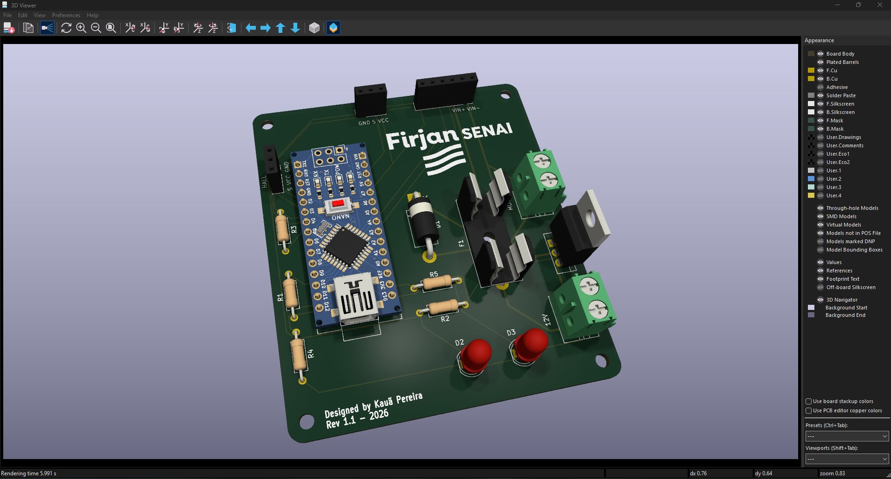

  

## 🛠️ Especificações e Limites da Placa

- **Tensão Máxima:** 12V DC.
- **Corrente Máxima do Motor:** Suporta até **3A em stall**.
- **Proteções:** Soquete para **fusível cilíndrico 5x20mm** (Ação Retardada) e diodo de proteção **1N5822**.
- **Chaveamento do Motor:** MOSFET **IRLZ44N**.

---

## 🧩 Lista de Componentes

### Placa e Circuito Principal
| Qtd | Componente | Descrição |
|---|---|---|
| 1 | Arduino Nano V3 | Microcontrolador central |
| 1 | MOSFET IRLZ44N | Controle PWM do motor |
| 1 | Diodo 1N5822 | Diodo de roda-livre / proteção |
| 2 | Terminal Block 5mm (2 pinos) | Entrada de energia 12V e motor |
| 1 | Soquete para Fusível | Porta-fusível 5x20mm |
| 2 | LED 5mm | LEDs de sinalização / status |
| 1 | Resistor 4.7kΩ | Pull-up do sensor de temperatura |
| 1 | Resistor 10kΩ | Pull-down do MOSFET |
| 2 | Resistores 220Ω | Limitadores para os LEDs |
| 2 | Conectores 1x03 | Conexão do Sensor Hall e DS18B20 |
| 1 | Conector 1x06 | Conexão do INA219 |

### Sensores Suportados
Para usar todas as funções da placa, conecte os seguintes módulos externos:
- **Temperatura:** Sensor **DS18B20** (1-Wire, utiliza o resistor de 4.7kΩ de pull-up da placa).
- **Corrente e Tensão:** Módulo **INA219** (Comunicação I2C).
- **Rotação / RPM:** Sensor **Hall de 3 pinos** (Medição de velocidade).
